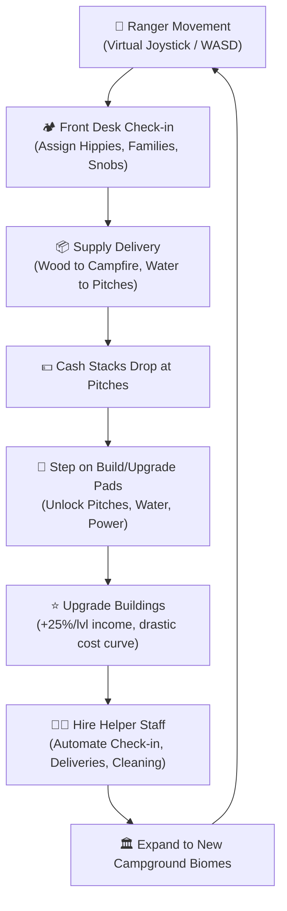
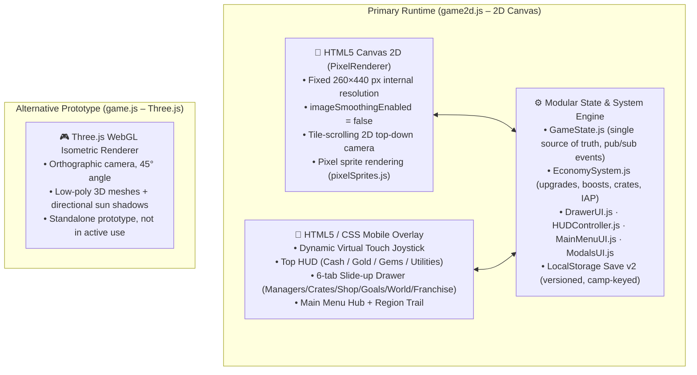

# Game Design Document – *Campers: Pocket Resort* (2D Pixel Art Edition)

> **Version:** 5.1.0  
> **Status:** Active Development – Live Events & Offline Earnings Modal Implemented  
> **Target Platforms:** Mobile (iOS / Android Web / PWA, Native Wrapper via Capacitor)  
> **Orientation:** Portrait (9:16 to 20:9 Mobile Screen Ratio)  
> **Genre:** 2D Top-Down Arcade Idle / Cozy Camp Tycoon (*Stardew Valley*, *Pokémon GBA*, *Kairosoft* style)  
> **Visual Style:** 2D Top-Down (3/4 View) 16-Bit Pixel Art (Tilemap, animated 2D pixel character sprites, Stardew item carrying, crisp pixel scaling)

---

## 1. Executive Summary & Vision

### 1.1 Vision Statement

*Campers: Pocket Resort* captures the cozy, nostalgic warmth of classic 16-bit pixel art games like ***Stardew Valley*** and ***Pokémon (GBA)*** merged with the accessible management mechanics of ***RollerCoaster Tycoon*** and modern Arcade Idlers.

Instead of 3D polygons, the game is built entirely in **hand-crafted 2D pixel art**. Players guide the Camp Ranger through lush green meadows, winding dirt paths, and tranquil ponds. You carry chopped firewood over your head, greet pixel guests at the front desk, kindle the crackling campfire, step onto glowing build pads, and expand your campground into a bustling 5-star outdoor haven.

### 1.2 Core Pillars

1. **Authentic 16-Bit Pixel Art:** Warm Stardew/Pokémon palette, tile-based dirt trails and wildflowers, 4-directional animated pixel sprites, and cozy pixel campfires with dancing embers.
2. **Physical Arcade Idle Action:** Walk around to solve tasks—carry items above your head, chop logs, pick up dropped coin stacks, and stand on circular pads to construct and upgrade buildings.
3. **Up to 13 Accommodation Pitches:** Each camp supports up to 13 distinct pitches across 7 tiers (Pup Tents, Caravans, Glamping Domes, A-Frame Cabins, Forest Chalets, Safari Lodges, Imperial Villas) accommodating **30+ simultaneous campers**.
4. **The Utility Balancing Act (Electricity ⚡ & Water 💧):** Pitches require utilities to run at full speed; build pixel water wells and power generators to avoid brownouts.
5. **Building Upgrade System:** Every pitch and utility can be upgraded up to a **max level** determined by the current camp number and region. Upgrades drastically increase income (+25% per level base, with 2×–3× milestone leaps) at increasingly steep exponential costs.
6. **Staff Wage & Cash Management:** Hired workers earn per-level wages continuously deducted from Camp Cash. Staff goes on strike if wages can't be paid — balancing investment vs. liquidity is the key management challenge.
7. **Automation with Pixel Helpers:** Unlock specialist managers to automate sweeping, check-ins, fishing, and campfire stocking.
8. **Mobile Portrait Ergonomics:** Dynamic virtual touch joystick (touch anywhere on the lower screen) + WASD/Arrow keys for desktop.
9. **Franchise Empire & Meta-Progression:** Manage an empire of campsites across **100 real-world regions** on Planet Earth. Earn Empire Gold from passive automated camps and spend it on global Franchise Upgrades that persist across all locations.
10. **Crates, Cards & Events:** Unlock and level up Staff Workers using a **card-collection system**. Open supply crates to earn Manager Cards. Participate in limited-time **Events** to reach milestones and earn exclusive rewards.

---

## 2. Core Game Loop: Arcade Idle Flow



### 2.1 The Gameplay Cycle

1. **Camper Arrival:** Guests arrive at the Campground Gate / Reception Desk.
2. **Player Interaction:**
   - Stand in the **Reception Pad** to assign the camper to a vacant pitch (Tents, Caravans, Glamping Domes, Cabins, etc.).
   - Deliver required supplies (e.g. Firewood to Campfires, Fresh Water bottles to Glamping tents).
3. **Satisfaction & Cash Drop:** Campers enjoy their stay, pay a check-in tip, and at checkout drop stacks of dollar bills at their pitch. Payout = `pitch.baseIncome × (isJoy ? 1.5 : 1.0) × (guestCount / baseCapacity)`.
4. **Reinvestment (Stand-to-Pay Pads):**
   - The player walks onto glowing circular **Build Pads** (`[ $110 Pup Tent #2 ]`, `[ $65 Water Well ]`).
   - Cash rapidly streams from the player's wallet into the pad until the target is met, triggering a celebratory pop and new building spawn.
   - **Upgrade Pads** (blue/gold ring) surround every existing building. Standing on one channels cash to upgrade the building level, showing the remaining cost and target level.
5. **Automation Hand-off:**
   - Unlock the **Staff Cabin** to hire **Helper Rangers** (e.g. *Clerk Alex*, *Mechanic Finn*).
   - Helpers automatically guide guests, restock wood, and collect cash, freeing the player to explore and expand new zones.
   - Workers draw **wages from Camp Cash**; insufficient cash triggers a **staff strike**.

---

## 3. Player Character & Backpack Mechanics

### 3.1 The Camp Ranger (Avatar)

- **Controls:**
  - **Mobile:** Dynamic Virtual Joystick (touch anywhere on the lower screen half to spawn joystick and run).
  - **Desktop / Dev:** WASD / Arrow Keys.
- **Starting Attributes:**
  - **Movement Speed:** `92 px/s` (base) → upgradeable via Franchise Sprint upgrade (+16 px/s per level, max 10 levels).
  - **Backpack Capacity:** `4 items` → upgradeable via Franchise Backpack upgrade (+2 per level, max 10 levels).
  - **Starting Cash:** `$150` per new campsite (+ $100 per level of Franchise Seed Capital).
  - **Interaction Radius:** Proximity-based – walking within range of a woodpile, campfire, build pad, or cash drop triggers automatic interaction.

### 3.2 Visual Item Stacking

Items carried by the Ranger physically stack upward in a wobbling tower behind their back:

- 🪵 **Firewood Logs:** Used for Campfires and warming Cabins.
- 💧 **Water Canteens:** Delivered to Family pitches and Glamping sites.
- 💵 **Cash Bundles:** Carried to bank vaults or spent directly onto build pads.
- 🧹 **Trash Bags:** Collected from vacated pitches and thrown into the Recycling Dumpster.

---

## 4. Campground Infrastructure & Zones

```
+----------------------------------------------------------------+
|                      RIVER / LAKE EDGE                         |
|   [💧 Water Well]                  [🎣 Fishing Pond Pier]      |
|                                                                |
|   [⛺ Pitch 1: Pup Tent]           [🛖 Pitch 4: A-Frame Cabin] |
|              \                           /                     |
|               \                         /                      |
|                ---- [🔥 CENTRAL HEARTH] ----                   |
|               /                         \                      |
|              /                           \                     |
|   [🚐 Pitch 2: Caravan]            [⛺ Pitch 3: Glamping]      |
|                                                                |
|   [⚡ Generator Shed]               [🧑‍🌾 Staff Bunkhouse]       |
|   [🏪 Snack Kiosk]                 [⚽ Sports Field (C5+)]     |
|                                                                |
|                   [📋 RECEPTION / CHECK-IN]                    |
|                               |                                |
|                        == ENTRANCE ROAD ==                     |
+----------------------------------------------------------------+
```

### 4.1 Accommodation Pitches (Full Roster)

Up to **13 pitches** per camp, unlocked progressively via build pads as the camp level increases.

| # | ID | Name | Tier | Capacity | Base Income | Camp Unlock | Stay Duration |
|---|---|---|---|---|---|---|---|
| 1 | `tent_1` | Pup Tent #1 | tent | 2 | $35 | Camp 1 (starter) | 4.5s |
| 2 | `caravan_1` | Caravan #1 | caravan | 3 | $95 | Camp 1 (starter) | 7.5s |
| 3 | `tent_2` | Pup Tent #2 | tent | 2 | $35 | Camp 1+ ($110) | 4.5s |
| 4 | `caravan_2` | Caravan #2 | caravan | 3 | $105 | Camp 2+ ($160) | 7.5s |
| 5 | `tent_3` | Pup Tent #3 | tent | 2 | $30 | Camp 3+ ($210) | 4.5s |
| 6 | `glamp_3` | Glamping Geo-Dome | glamping | 3 | $140 | Camp 3+ ($280) | 10s |
| 7 | `caravan_3` | Caravan #3 | caravan | 3 | $85 | Camp 4+ ($350) | 7.5s |
| 8 | `glamp_2` | Premium Glamping Suite | glamping | 4 | $220 | Camp 5+ ($480) | 10s |
| 9 | `cabin_4` | A-Frame Forest Cabin | cabin | 3 | $180 | Camp 6+ ($620) | 14s |
| 10 | `chalet_1` | Forest Chalet | chalet | 4 | $320 | Camp 7+ ($850) | 18s |
| 11 | `caravan_4` | Luxury RV Haven | caravan | 4 | $260 | Camp 8+ ($1,050) | 14s |
| 12 | `lodge_1` | Safari Wilderness Lodge | lodge | 4 | $480 | Camp 9+ ($1,600) | 21s |
| 13 | `villa_1` | Imperial Royal Villa | villa | 6 | $750 | Camp 10+ ($2,800) | 24s |

> [!NOTE] Base income values are scaled by `incomeMult = 1.30^(camp-1) × regionBonus × worldBonus` on initialization. `rawBaseIncome` is stored separately to allow re-calculating `baseIncome = rawBaseIncome × getBuildingIncomeMultiplier(level)` on every upgrade.

### 4.2 Utilities (The Grid System)

| Utility | Build Cost (C1) | Unlock | Effect |
|---|---|---|---|
| **Water Well** 💧 | $65 | Always available | +5 m³/s water capacity base; +1 m³ per upgrade level |
| **Generator** ⚡ | $85 | Always available | +11 kW power capacity base; +3 kW per upgrade level |
| **Snack Kiosk** 🏪 | $70 | Always available | Generates $22 × `getBuildingIncomeMultiplier(kioskLvl)` per visit |
| **Canoe Rental Dock** 🛶 | $95 | Camp 2+ | Generates $35 × `getBuildingIncomeMultiplier(canoeLvl)` per visit |
| **Alpine Sauna & Onsen** ♨️ | $180 | Camp 4+ | Requires 2 Water load; generates $55 × `getBuildingIncomeMultiplier(saunaLvl)` |
| **Sports Field** ⚽ | $130 | Camp 5+ | Guest satisfaction bonus; upgradeable |
| **Robin's Cards** 🪵 | $75 | Always available | One-time pad: grants +3 Epic Robin Cards on completion |

- When total **power demand > capacity** or **water demand > capacity**, checkout income drops by 50%.
- Generator and Water Well capacity increase each upgrade level.

### 4.3 Amenities & Activities

- **Central Campfire:** Gathering point for Hippies; produces **+50% income (Joy Frenzy)** for all pitches when stocked with firewood.
- **Snack Kiosk:** Scaled by kiosk upgrade level — revenue is `$22 × getBuildingIncomeMultiplier(kioskLvl)` per sale; automated by Bella.
- **Canoe Rental Dock:** Moored alongside pond; tourists rent canoes generating `$35 × getBuildingIncomeMultiplier(canoeLvl)`.
- **Alpine Sauna & Onsen:** Steaming hot spring bath requiring water grid connection; visitors pay `$55 × getBuildingIncomeMultiplier(saunaLvl)`.
- **Fishing Pond Pier:** Player walks to the pier to catch fish ($40/catch at 1.8s); automated by Finn.

---

## 5. Building Upgrade System

Every building (pitch, utility, kiosk, sports field) can be upgraded via **blue Upgrade Pads** positioned around each building on the map.

### 5.1 Max Level Per Camp

Max upgrade level scales with camp progression within the current region and world:

| Camp | Max Level (Region 1) | Max Level (Region 2) | … |
|---|---|---|---|
| 1 | 10 | 20 | +10 per region |
| 2 | 20 | 30 | |
| 3 | 25 | 35 | |
| 4 | 30 | 40 | |
| 5 | 35 | 45 | |
| 6 | 40 | 50 | |
| 7 | 45 | 55 | |
| 8 | 50 | 60 | |
| 9 | 55 | 65 | |
| 10 | 60 | 70 | +50 per world |

**Formula:** `maxLevel = baseLevelForCamp + (region - 1) × 10 + (world - 1) × 50`

### 5.2 Income Multiplier (`getBuildingIncomeMultiplier`)

```
mult = 1.0 + (level - 1) × 0.25   // +25% per level base
if level ≥ 10:  mult × 2.0         // 2× milestone bonus
if level ≥ 20:  mult × 2.0         // 2× milestone bonus  
if level ≥ 25:  mult × 2.5         // 2.5× milestone bonus
if level ≥ 50:  mult × 3.0         // 3× milestone bonus
```

| Level | Multiplier | Total vs. Level 1 |
|---|---|---|
| 1 | 1.0× | 1.0× |
| 5 | 2.0× | 2.0× |
| 10 | 6.5× | 6.5× (+1 bonus capacity bed) |
| 20 | 23.0× | 23.0× |
| 25 | 70.0× | 70.0× (+1 capacity bed) |
| 50 | 397.5× | 397.5× (+1 capacity bed) |

### 5.3 Upgrade Cost Curve (`getBuildingUpgradeCost`)

```js
cost = Math.round(baseCost × Math.pow(1.34, currentLevel - 1) × costMult)
```

Base costs per building type:

| Building | Base Cost (Lvl 2) |
|---|---|
| Pup Tent #1 | $45 |
| Caravan #1 | $85 |
| Pup Tent #2 / #3 | $55 / $75 |
| Caravan #2 / #3 | $100 / $160 |
| Glamping Dome | $180 |
| Premium Glamping | $360 |
| A-Frame Cabin | $260 |
| Forest Chalet | $520 |
| Luxury RV Haven | $720 |
| Safari Lodge | $1,050 |
| Imperial Villa | $1,600 |
| Water Well | $60 |
| Generator | $75 |
| Snack Kiosk | $65 |
| Canoe Rental Dock | $85 |
| Sports Field | $120 |
| Alpine Sauna | $140 |

**Example:** Upgrading Tent #1 to Level 10 costs approx. **$1,712 total**.

### 5.4 Upgrade UX

- **Upgrade Pad:** Blue/gold dashed ring near each building showing `$[remaining]` and `★ Lv.[target]`.
- **On Completion:** Float text shows `⭐ [Name] Lv.[N]! (+[X]% Ertrag)` in cyan, fanfare sound plays.
- `pitch.baseIncome` is immediately recalculated as `rawBaseIncome × incomeMult`, ensuring HUD, checkout, and rate calculations stay in sync.
- **Bonus Capacity:** Level 10 → +1 bed, Level 25 → +2 beds, Level 50 → +3 beds (cumulative).

---

## 6. Camper Archetypes & Behaviors

| Archetype | Desired Bubble & Pitch | Key Need | Behavioral Quirk |
| -- | -- | -- | -- |
| 🌿 **Hippies** | `⛺` Tent (65%), `🚐` Caravan (35%) | Campfire & Nature | Arrive in solo/duos; generate extra tips if campfire is blazing. |
| 👨‍👩‍👧 **Families** | `🚐` Caravan (55%), `🏠` Cabin (35%), `⛺` Tent (10%) | Water & Playground | Arrive in parties of 2-3; high snack bar consumption; higher pitch stay income. |
| 💎 **Snobs** | `🛖` Glamping Dome (55%), `🏠` Cabin (35%), `🚐` Caravan (10%) | 100% Power & Water | Walk with brisk strides; drop huge piles of golden cash. |
| 🦝 **Trash Raccoon (Event)** | Dumpster | Distraction | Sneaks into camp; player must chase it off to claim a dropped loot bag. |
| 🤳 **VIP Influencer** | Any Luxury Pitch | Photo Ops | Spawns a 60-second resort-wide 2x income multiplier. |

### 6.1 Dynamic Request & Accommodation Matching

1. **Visual Speech Bubbles:** Campers arrive displaying their desired accommodation emoji above their head (`⛺` Pup Tent, `🚐` Retro Caravan, `🛖` Glamping Dome, `🏠` Log Cabin).
2. **Prioritized Matching:** The front desk first matches guests to an open pitch of their exact requested tier.
3. **Queue Polling & Non-blocking Dispatch:** If the front party is waiting for a busy Caravan, parties behind them requesting open Tents or Domes can still be checked in, preventing queue deadlocks.
4. **Flexible Fallbacks & Upgrades:** If a requested luxury tier is not yet constructed or has been occupied for over 7.5 seconds, guests accept available alternative pitches with a delighted sparkle (`✨`).

---

## 7. Multi-Worker Staff & Automation System

Automation is distributed across **8 specialized workers**, each with their own dedicated station/zone and progressive upgrade path in the **Staff & Upgrades Drawer**.

### 7.1 Front Desk Clerks (Check-in Automation)

| Worker | Role & Station | Base Cost | Max Level | Upgrade Progression |
| --- | --- | --- | --- | --- |
| 🧑‍💼 **Clerk Alex** | Front Desk Clerk #1 (Reception counter left) | $25 | 4 | Lvl 1: Auto check-in every 2.0s → Lvl 2: 1.3s (+$5 tip) → Lvl 3: 0.8s (+$12 tip) → Lvl 4: 0.4s (+$22 tip) |
| 🧑‍💻 **Clerk Sam** | Front Desk Clerk #2 (Reception counter right) | $50 | 3 | Lvl 1: Dual check-in lane (1.8s +$5 tip) → Lvl 2: 1.0s (+$12 tip) → Lvl 3: VIP Express 0.5s (+$25 tip) |

*With both clerks hired, reception handles dual queue lines concurrently without requiring the player to stand at the desk.*

### 7.2 Zone Cleaners (Trash Sweeping & Cash Collection)

| Worker | Zone / Patrol Territory | Base Cost | Max Level | Upgrade Progression |
| --- | --- | --- | --- | --- |
| 🧹 **Oliver** | West Meadow (Tents only) | $20 | 3 | Lvl 1: Sweeps Tents at 52 px/s → Lvl 2: Roller Skates (78 px/s +$5 trash bonus) → Lvl 3: Turbo Sweeper (105 px/s +$15) |
| 🧽 **Chloe** | East Lane (Caravans only) | $40 | 3 | Lvl 1: Sweeps Caravans at 56 px/s +$5 → Lvl 2: Speed boost (82 px/s +$12) → Lvl 3: Eco-Mop Pro (112 px/s +$22) |
| ✨ **Felix** | North Forest (Glamping, Cabin, Chalet, Lodge, Villa) | $70 | 3 | Lvl 1: Sweeps Lodges at 60 px/s +$10 → Lvl 2: Polished Butler (88 px/s +$20) → Lvl 3: White Glove (120 px/s +$35) |

*Zone cleaners are strictly scoped to their accommodation tier — Oliver only cleans tents, Chloe only caravans, Felix only luxury lodges.*

### 7.3 Specialist Workers

| Worker | Specialization & Station | Base Cost | Max Level | Upgrade Progression |
| --- | --- | --- | --- | --- |
| 🎣 **Finn** | Master Fisherman (Pond Pier) | $45 | 4 | Lvl 1: Auto-catches fish every 3.6s ($30) → Lvl 2: Carbon Rod (2.5s, $50) → Lvl 3: Golden Lures (1.6s, $80) → Lvl 4: Trophy Angler (1.0s, $130) |
| ☕ **Bella** | Kiosk Barista (Snack Kiosk) | $30 | 4 | Lvl 1: Serves snacks every 4.0s ($25) → Lvl 2: Espresso Bar (2.8s, $45) → Lvl 3: Gourmet Treats (1.8s, $75) → Lvl 4: Cafe Delite (1.1s, $120) |
| 🪵 **Robin** | Fire Tender & Woodcutter (Campfire/Woodpile) | $60 | 3 | Lvl 1: Hauls 1 log at 60 px/s (+18s Frenzy) → Lvl 2: Log Cart (2 logs, 78 px/s, +28s Frenzy) → Lvl 3: Timber Master (3 logs, 98 px/s, +42s Frenzy +$25 Tip) |

> [!NOTE] Robin also provides a **passive Joy Frenzy boost** to all income: `totalRate *= 1.0 + 0.18 × robinLevel` in the active rate formula.

### 7.4 Camp Ranger (Player Upgrades)

> [!NOTE] Ranger upgrades are **global Franchise Upgrades** (§12.4), paid with Empire Gold – not per-camp upgrades.

- 👟 **Ranger Sprint:** Base 92 px/s → +16 px/s per level, up to 10 levels. Cost formula: `40 × 1.65^(level-1)` Empire Gold.
- 🎒 **Heavy Backpack:** Base 4 cargo slots → +2 per level, up to 10 levels. Cost formula: `50 × 1.70^(level-1)` Empire Gold.

### 7.5 Worker Hire Costs & Card Requirements

| Worker | Hire Cost (Cash) | Unlock Cards | Rarity | Hire Prerequisite |
| --- | --- | --- | --- | --- |
| 🧑‍💼 Alex | $25 | 1 card | Common | Check in 1st camper party |
| 🧹 Oliver | $20 | 1 card | Common | Sweep 1 trash bag OR serve 3 campers |
| ☕ Bella | $30 | 1 card | Common | Build Snack Kiosk |
| 🧑‍💻 Sam | $50 | 2 cards | Rare | Serve 10 campers OR build a pitch |
| 🧽 Chloe | $40 | 2 cards | Rare | Build Caravan #2 OR serve 6 campers |
| 🎣 Finn | $45 | 2 cards | Rare | Build Water Well OR catch 3 fish |
| 🪵 Robin | $60 | 3 cards | Epic | Feed campfire 3× OR buy Robin's Cards pad |
| ✨ Felix | $70 | 3 cards | Epic | Build Glamping Dome, Cabin, Chalet, Lodge or Villa |

### 7.6 Worker Rarity & Loot Pool

Workers are grouped into three **rarity pools** that determine crate drop chances:

| Rarity | Workers | Base Drop Chance (random fill) |
| --- | --- | --- |
| Common | Alex 🧑‍💼, Oliver 🧹, Bella ☕ | 55% |
| Rare | Sam 🧑‍💻, Chloe 🧽, Finn 🎣 | 30% |
| Epic | Felix ✨, Robin 🪵 | 15% |

### 7.7 Staff Wage & Strike System

Every hired worker draws a **per-level wage** ($/s) continuously deducted from Camp Cash via `getTotalStaffWage()`.

**Wage table ($/s per level):**

| Worker | Lvl 1 | Lvl 2 | Lvl 3 | Lvl 4 |
|---|---|---|---|---|
| 🧑‍💼 Alex | 0.8 | 1.8 | 3.8 | 8.0 |
| 🧑‍💻 Sam | 1.4 | 3.0 | 6.5 | — |
| 🧹 Oliver | 0.6 | 1.5 | 3.2 | — |
| 🧽 Chloe | 1.0 | 2.2 | 4.8 | — |
| ✨ Felix | 1.8 | 3.8 | 8.0 | — |
| 🎣 Finn | 1.6 | 3.8 | 8.5 | 18.0 |
| ☕ Bella | 1.4 | 3.2 | 7.0 | 15.0 |
| 🪵 Robin | 1.2 | 2.6 | 5.5 | — |

**Strike mechanics:**
- If `state.cash < totalWages` per tick, the `staffOnStrike` flag activates.
- The **Cash HUD pill flashes red** with a strike warning: *„⚠️ STREIK: Zu wenig Bargeld für Gehälter!"*
- Staff workers **pause their automation** until wages can be paid.
- This creates a meaningful cash management loop — the player must balance investing in build/upgrade pads vs. keeping enough liquidity to pay their team.

---

## 8. Mobile UI & Screen Architecture

### 8.1 Camera Setup (game2d.js – 2D Canvas Renderer)

The primary renderer is **`game2d.js`** – a native HTML5 Canvas 2D engine with a fixed internal pixel resolution:

- **Internal Resolution:** 260×440 px (recalculated on resize to fit aspect ratio).
- **Rendering Style:** Crisp pixel art, `imageSmoothingEnabled = false`, scaled up to fill the device screen.
- **Camera:** Tile-scrolling 2D top-down camera (`camX`, `camY`) that follows the Ranger smoothly. Map size scales with camp level (380×540 → 880×1240 virtual pixels).

> [!NOTE] A secondary **Three.js isometric renderer** (`game.js`) also exists as an alternative prototype. The canonical gameplay experience runs on the 2D Canvas engine.

### 8.2 Top HUD Layout (Implemented)

```
+------------------------------------------+
| [💵 $1,250]  [🏛️ $340]  [💎 45]          |  <- Currency Row
| [⚡ 2/5 kW] [💧 1/5 m³] [🏕️ 3/8]  [W1R1:C2]|  <- Utility + Guests + Location
| [🪵 2/4]   [🔥 Joy: 12s]  [⚡ 2x BOOST 4m] |  <- Stack / Frenzy / Boost banners
+------------------------------------------+
```

- **💵 Camp Cash** – local camp currency pill (flashes red + strike warning when wages can't be met).
- **🏛️ Empire Gold** – global vault balance.
- **💎 Gems** – premium currency count.
- **⚡ kW / 💧 m³** – utility gauges (turn red `overload` class when demand exceeds capacity).
- **🏕️ Active/Total** – current guests vs. total sleeping capacity (e.g. `6/14`).
- **W1R1:C2** – compact world/region/camp location indicator.
- **🔥 Joy Frenzy banner** – shows remaining Frenzy seconds when campfire is active.
- **⚡ Boost banner** – shows active boost multiplier and countdown timer.
- **Empire Idle pill** – appears when background camps are generating Gold (shows `+$X.X/s`).

### 8.3 Bottom Drawer – 6 Tabs

The slide-up drawer has **6 tabs**, each with a notification badge:

| Tab | Icon | Badge Condition | Contents |
| --- | --- | --- | --- |
| **Managers** | 🧑‍🌾 | 🔴 when worker can be hired/upgraded | Worker cards, card meters, hire buttons |
| **Crates** | 📦 | `FREE` when free crate is ready | All 5 crate tiers with open buttons |
| **Shop** | 💎 | — | Time Warps, Boosts, Gem Crates, IAP |
| **Goals** | 🏆 | 🔴 count of claimable achievements | Achievement list with progress bars & claim buttons |
| **World** | 🗺️ | — | Region camp grid, idle rates, advance button |
| **Franchise** | ⭐ | — | Empire Vault balance + 6 global upgrades |

**Manager sub-tabs** filter workers by category: `All · Front Desk · Cleaners · Specialists`.

### 8.4 Main Menu Hub Screen

A dedicated **Main Menu** overlays the game world when the player opens the hub (⏸️ button or back gesture). It shows:

- **Currency bar:** Camp Cash, Empire Gold, Gems, free crate countdown.
- **Region Trail:** Scrollable list of the current region's 10 camps, each shown as a trail node with:
  - Status icon: 🏕️ Active · 🏰 Cleared · ⛺ Unlocked · 🔒 Locked
  - Idle Gold rate for cleared camps (`+$X.X/s Tresor-Gold`)
  - PLAY / BESUCHEN / GESPERRT buttons
  - Region navigation arrows (← Region 1–100 →)
  - Progress bar: `N / 10 Camps abgeschlossen`

### 8.5 Goal Toast System

When an achievement goal is completed mid-session, a **toast popup** appears over the game world:

- Stacks vertically for simultaneous completions.
- Contains: achievement icon, title, reward description, and a **CLAIM 🎉** button.
- Auto-dismisses after **20 seconds** if not tapped.
- Tapping the toast immediately claims the reward (cards + cash + gems) without opening the drawer.

### 8.6 Touch Ergonomics

- **No Static Joystick:** Touching down anywhere on the lower screen half anchors the virtual joystick; dragging moves the Ranger.
- **Proximity Automation:** Walking near a woodpile, campfire, build pad, upgrade pad, or cash drop triggers the interaction automatically — no tap required.
- **Haptic Feedback:** ⬜ Planned (not yet implemented).

---

## 9. Technology Stack

### 9.1 Actual Stack: HTML5 Canvas 2D + Modular JS Architecture



### 9.2 Module Overview

| File | Responsibility |
| --- | --- |
| `game2d.js` | Primary game loop, 2D canvas rendering, all gameplay systems |
| `pixelSprites.js` | `PixelRenderer` class + `PIXEL_COLORS` palette |
| `state/GameState.js` | Save/load (LocalStorage v2), pub/sub events, currency transactions |
| `systems/EconomySystem.js` | Franchise upgrades, time warps, boosts, IAP gems, crate loot, achievement claims |
| `ui/DrawerUI.js` | All 6 drawer tabs rendered as HTML |
| `ui/HUDController.js` | HUD update, badge logic, goal toast system |
| `ui/MainMenuUI.js` | Main menu hub + region trail rendering |
| `ui/ModalsUI.js` | World modal, Events modal, Crate unboxing overlay |
| `config/managers.js` | Worker definitions, levels, prerequisite conditions, wage table |
| `config/buildings.js` | `getMaxBuildingLevel`, `getBuildingUpgradeCost`, `getBuildingIncomeMultiplier`, `getBuildingBonusCapacity` |
| `config/crates.js` | All 5 crate tier definitions |
| `config/franchise.js` | 6 global franchise upgrade definitions |
| `config/achievements.js` | 13 camp-scaled achievement generators (incl. upgrade goals) |
| `config/events.js` | Current event definition (milestones, rewards) |
| `config/rates.js` | Active/idle income rate formulas (incl. building upgrade bonus) |
| `config/worlds.js` | 5 biomes, 10 camp configs, Earth region helpers |
| `config/earth100.js` | 100 real-world region definitions with geo-metadata |

### 9.3 Save System

- **Key:** `campers_pixel_save_v2` (LocalStorage)
- **Version:** `SAVE_VERSION = 2` — mismatched versions auto-clear stale saves.
- **Structure:** Global state (currencies, franchise upgrades, events, crates) + per-camp snapshots keyed as `w{world}_r{region}_c{camp}`.
- **Camp state includes:** `buildingLevels` (map of buildingId → currentLevel), `completedPads`, `managers`, `stats`, `cash`.
- **Auto-save:** Triggered after every significant state change (hire, upgrade, crate open, achievement claim, camp switch).

---

## 10. Currency System

The game uses a **three-tier currency system**, each with distinct acquisition paths and spending purposes.

### 10.1 Currency Overview

| Currency | Icon | Scope | Source | Spent On |
| --- | --- | --- | --- | --- |
| **Camp Cash** | 💵 | Per-Camp | Collecting pitch checkout drops, check-in tips, kiosk/fishing income | Build Pads, Upgrade Pads, Staff hire |
| **Empire Gold** | 🏛️ | Global | Passive income from automated (background) campsites at 45% idle efficiency | Franchise global upgrades, new camp unlocks |
| **Gems** | 💎 | Global (Premium) | Achievements, event milestones, Mythic/Emperor crates | Premium crates, instant boosts |

### 10.2 Income Multipliers

- **Campfire Joy Frenzy (1.5×):** Active when the campfire is stocked with firewood. All pitch checkout income is multiplied by 1.5.
- **Building Upgrade Income:** `pitch.baseIncome = rawBaseIncome × getBuildingIncomeMultiplier(level)`. Checkout payout = `baseIncome × joyMult × (guestCount / baseCapacity)`.
- **Global Franchise Boost:** Each level of the *Empire Franchise Boost* upgrade adds a permanent **+15% revenue multiplier** across all campsites (stacks additively).
- **Timed Boost:** An event or vault reward can activate a temporary `boostMultiplier` (default 2×) for a configurable number of seconds via `boostTimer`. Boosts stack additively in duration; only the highest multiplier applies at once.
- **Building Upgrade Throughput Bonus (Active Rate):** `totalRate *= 1.0 + min(15.0, totalUpgradeLevels × 0.10)` — up to +1,500% active throughput bonus from cumulative building upgrades across the camp.

### 10.3 Gem Shop – Purchaseable Items

| Item | Gem Cost | Effect |
| --- | --- | --- |
| ⏱️ 1h Time Warp | 30 💎 | Instantly pays out 1h of active + empire income |
| ⏳ 4h Time Warp | 80 💎 | Instantly pays out 4h of total production |
| 🌌 24h Mega Warp | 250 💎 | One full day of multi-campsite revenue in a flash |
| ⚡ 2× Revenue Boost (2h) | 50 💎 | Doubles all income for 2 hours |
| 🚀 3× Super Boost (4h) | 120 💎 | Triples all income for 4 hours |
| 🔮 Mythic Supply Crate | 100 💎 | 14–18 Cards + cash (see §11) |
| 👑 Emperor Vault | 250 💎 | 32–42 Cards + cash (see §11) |

> [!TIP] Time Warps pay out both **Camp Cash** (active rate) and **Empire Gold** (idle rate of other camps) simultaneously, making them especially powerful after unlocking multiple automated campsites.

---

## 11. Manager Cards & Crate System

Workers are not bought directly with cash — they are **unlocked and leveled up using Manager Cards**, obtained from supply crates.

### 11.1 Manager Card Mechanics

- Each worker has a **rarity tier** (Common, Rare, Epic) and requires a specific number of cards to unlock/upgrade.
- Cards are awarded via: **Achievements**, **Crate openings**, and **Event milestones**.
- A worker's `unlockCards` threshold must be met before they can be hired; subsequent `cardsReq` thresholds unlock higher levels.

### 11.2 Crate Definitions

| Crate | Icon | Cost | Card Yield | Cash Bonus | Guarantee |
| --- | --- | --- | --- | --- | --- |
| 🎁 **Free Supply Crate** | 🎁 | Free (90 min cooldown) | 2–3 Cards | $25–$50 | — |
| 📦 **Wooden Supply Crate** | 📦 | $80 | 4–5 Cards | $40–$80 | ≥1 Rare |
| 👑 **Golden Resort Crate** | 👑 | $220 | 8–10 Cards | $100–$220 | 1 Epic + Rares |
| 🔮 **Mythic Supply Crate** | 🔮 | 100 💎 | 14–18 Cards | $350–$800 | 2+ Epics, 4+ Rares |
| 👑 **Emperor Vault** | 👑 | 250 💎 | 32–42 Cards | $1,200–$3,000 | 6+ Epics, 10+ Rares |

> [!NOTE] The **Emperor Vault** is typically reserved as an exclusive event milestone reward, not purchased directly in the regular shop.

---

## 12. Franchise Empire & World Map

The Franchise Empire is the **meta-progression layer** that connects all individual campsites into a global resort chain.

### 12.1 Progression Structure

```
Planet Earth
└── 100 Regions (Schwarzwald, Berner Oberland, Tiroler Alpen … )
    └── Each Region: 10 Camps (Forest Outpost → Imperial Empire Sanctuary)
        └── Each Camp: Full Arcade Idle Loop (pitches, workers, pads, upgrades)
```

- **World 1: Planet Earth** consists of **100 unique real-world regions**, each with a distinct geographical theme, country flag, color palette, tree type, and accommodation style.
- Each region has **10 camps** of increasing size (380×540 px → 880×1240 px) and pitch capacity (4 → 13 pitches).
- Income scales with camp progression: base multiplier `1.30^(camp-1)`, further boosted by region (+12% per region) and world tier (+50% per world).

### 12.2 Camp Size Progression

| Camp | Map Size | Max Pitches | Max Bldg Level (R1) | Name | Tier |
| --- | --- | --- | --- | --- | --- |
| 1 | 380×540 | 4 | 10 | Forest Outpost | Starter Glade |
| 2 | 420×600 | 5 | 20 | Trailside Camp | Expanding Clearing |
| 3 | 465×670 | 6 | 25 | Riverbend Park | Lakeside Camp |
| 4 | 515×740 | 7 | 30 | Meadow Valley | Holiday Meadow |
| 5 | 570×820 | 8 | 35 | Pine Ridge Resort | Active Resort |
| 6 | 630×900 | 9 | 40 | Sunny Oasis Park | Holiday Park |
| 7 | 690×980 | 10 | 45 | Mountain Haven | Luxury Alpine Resort |
| 8 | 750×1060 | 11 | 50 | Emerald Wilderness | Expansive Eco Paradise |
| 9 | 810×1140 | 12 | 55 | Grand Vista Resort | Mega Vacation Complex |
| 10 | 880×1240 | 13 | 60 | Imperial Empire Sanctuary | Imperial Grand Resort |

### 12.3 Idle Empire Revenue

When the player is not actively managing a campsite, it continues generating **Empire Gold** at **45% of its active throughput** (passive franchise efficiency). The active rate is calculated from: pitch count × income multiplier + worker bonuses − total wages. Building upgrade levels add +10% throughput per total level above 1 (capped at +1,500%). This is settled as offline earnings when the player returns.

### 12.4 Franchise Upgrades (Global)

Purchased with **Empire Gold**, these upgrades persist permanently across all campsites in the franchise:

| Upgrade | Icon | Max Level | Effect |
| --- | --- | --- | --- |
| **Ranger Sprint** | 👟 | 10 | +16 px/s run speed per level |
| **Heavy Backpack** | 🎒 | 10 | +2 cargo slots per level |
| **Fast Investor** | 💸 | 10 | Build pads fill 50% faster per level |
| **Empire Franchise Boost** | 📈 | 10 | +15% permanent revenue multiplier per level |
| **Franchise Seed Capital** | 🪙 | 10 | +$100 bonus starting cash per level when unlocking new camps |
| **Motivated Staff** | 🧹 | 10 | +15% walk speed for all cleaners & helpers per level |

---

## 13. Achievements System

Each campsite has **13 camp-scaled achievements**. Goals and rewards scale with the current camp number and region to maintain appropriate challenge across the full 100-region progression.

| ID | Title | Icon | Goal (Camp 1 example) | Reward |
| --- | --- | --- | --- | --- |
| `first_checkin` | First Arrivals | 🏕️ | Check in 3 camper parties | Alex Cards + Oliver Cards + Cash + 10 💎 |
| `busy_reception` | Bustling Resort | 📋 | Check in N camper parties | Sam Cards + Cash + 15 💎 |
| `campfire_glow` | Campfire Warmth | 🔥 | Feed firewood N times | Robin Cards + Cash + 10 💎 |
| `eco_warrior` | Clean Campground | 🧹 | Sweep N trash bags | Oliver Cards + Cash + 10 💎 |
| `clean_sweep` | Zero Waste Hero | 🧽 | Sweep N+ trash bags | Chloe Cards + Cash + 15 💎 |
| `pitch_upgrade` | Quality Stays | ⭐ | Upgrade any building to Level N (50% of maxLevel) | Chloe Cards + Cash + 15 💎 |
| `resort_rating` | Resort Expansion | 🏡 | Reach total building levels of N | Felix Cards + Cash + 20 💎 |
| `master_angler` | Pond Fisherman | 🎣 | Catch N prize fish | Finn Cards + Cash + 15 💎 |
| `snack_attack` | Kiosk Barista | ☕ | Make N kiosk sales | Bella Cards + Cash + 15 💎 |
| `cash_flow` | Gold Rush | 💵 | Earn $N total campsite revenue | Robin + Felix Cards + Cash + 25 💎 |
| `power_grid` | Power & Water | ⚡ | Build Generator + Water Well (+ Sports Field at Camp 5+) | Sam + Finn Cards + Cash + 20 💎 |

> [!TIP] Achievement rewards scale with `campScale = 1.24^(camp-1) × regionModifier`, keeping rewards meaningful throughout the entire progression arc. Building upgrade achievements (`pitch_upgrade`, `resort_rating`) target 50% and 150% of maxLevel respectively.

---

## 14. Events System

Limited-time **Special Events** run on a fixed schedule and layer additional objectives and rewards on top of the regular camp loop.

### 14.1 Event Structure

- **Duration:** Configurable per event (e.g. 64 hours).
- **Point Sources:** Check-ins, trash collection, campfire feeding, and other camp actions each award **Event Points**.
- **Milestone Ladder:** Each event has 4 milestone tiers. Reaching a milestone threshold claims its reward permanently.

### 14.2 Example Event: 🔥 Großes Waldfestival

> *Lagerfeuer-Nacht & Festtags-Jubel* – Earn event points through check-ins, trash collection, and campfire feeding to unlock franchise rewards!

| Milestone | Points Required | Reward |
| --- | --- | --- |
| Edelstein-Paket | 15 pts | 💎 35 Gems |
| Goldene Vorratskiste | 40 pts | 📦 Golden Resort Crate |
| Empire Tresor-Prämie | 80 pts | 🏛️ $450 Gold + ⚡ 1h Boost |
| Kaiserlicher Hauptpreis | 150 pts | 👑 Emperor Vault + 💎 100 Gems |

---

## 15. Implementation Roadmap

### Phase 1: Interactive 2D Prototype ✅ Implemented

- ✅ **HTML5 Canvas 2D pixel renderer** (`game2d.js` + `pixelSprites.js`) with fixed 260×440 px internal resolution.
- ✅ Ranger character with virtual joystick + WASD movement and smooth rotation.
- ✅ Pup Tent Pitch, Caravan Pitch, Glamping Dome, Reception Desk, Build Pads.
- ✅ Item carrying stack mechanics (wood logs on Ranger's back with sway physics).
- ✅ Wood chopping clearing + campfire feeding interaction.
- ✅ Three.js isometric renderer (`game.js`) as secondary alternative prototype.

### Phase 2: Campers & Utility Grid Loop ✅ Implemented

- ✅ Camper arrivals at reception desk with queue logic.
- ✅ Camper pathfinding to assigned pitch (lerp-based).
- ✅ Dropped cash stacks at checkout + proximity collection.
- ✅ Power (⚡) and Water (💧) utility buildings with capacity/overload display.
- ✅ Campfire Joy Frenzy multiplier (1.5× on firewood stock).

### Phase 3: Helper Staff & Upgrades ✅ Implemented

- ✅ 8 unique Staff Workers (Common/Rare/Epic) with card-based unlock and 3–4 upgrade levels each.
- ✅ Manager prerequisites (unlock conditions before hiring).
- ✅ 6-tab slide-up drawer (Managers · Crates · Shop · Goals · World · Franchise).
- ✅ Badge system on drawer tabs (free crate ready, upgradable workers, claimable achievements).
- ✅ Franchise-wide global upgrade system (6 persistent upgrades, paid with Empire Gold).
- ✅ Crate & gacha system (5 crate tiers, Free → Emperor Vault, with weighted rarity pools).
- ✅ Achievements system (13 camp-scaled achievements incl. building upgrade goals).
- ✅ Goal toast system (on-screen achievement popups, 20s lifespan, tap-to-claim).
- ✅ Event system with milestone ladder and time-limited runs.
- ✅ Full save/load persistence via LocalStorage v2 (versioned, camp-keyed).
- ✅ Empire Gold + Gems currency layer and passive idle revenue.
- ✅ 100 real-world region meta-map with 10 camps each.
- ✅ **Main Menu Hub** with Region Trail navigation (← Region →, 10 camp nodes, idle rates).
- ✅ Gem Shop (Time Warps, Income Boosts, Mythic/Emperor Crates).
- ✅ **Staff Wage & Strike system** (per-level wages; cash HUD flashes red; staff pauses on strike).
- ✅ Modular architecture (GameState / EconomySystem / DrawerUI / HUDController / MainMenuUI / ModalsUI).
- ✅ **13-tier accommodation roster** (Tents × 3, Caravans × 4, Glamping × 2, Cabin, Chalet, Lodge, Villa).

### Phase 4: Building Upgrade System ✅ Implemented

- ✅ **Per-building upgrade pads** (blue/gold ring) for all 13 pitches + 4 utility buildings.
- ✅ `getBuildingIncomeMultiplier(level)`: +25% per level with 2×/2×/2.5×/3× milestone multipliers at Lvl 10/20/25/50.
- ✅ `getBuildingUpgradeCost(id, level)`: exponential curve `base × 1.34^(level-1)` with drastic base costs per tier.
- ✅ `getMaxBuildingLevel(world, region, camp)`: Camp 1 → Lvl 10, scaling to Lvl 60 at Camp 10 (R1), +10/region, +50/world.
- ✅ `getBuildingBonusCapacity(level)`: +1 bed at Lvl 10, +2 at Lvl 25, +3 at Lvl 50.
- ✅ `pitch.baseIncome` always stores `rawBaseIncome × incomeMult` — single source of truth, no double-scaling.
- ✅ Kiosk revenue scales with kiosk upgrade level.
- ✅ Upgrade completion float text: `⭐ [Name] Lv.[N]! (+[X]% Ertrag)`.
- ✅ Building upgrade throughput bonus in active rate: +10% per total upgrade level, capped at +1,500%.
- ✅ Building upgrade achievement goals: `pitch_upgrade` and `resort_rating`.

### Phase 5: Polish, Audio & Mobile Feel ✅ Implemented

- ✅ Campfire smoke particles, floating coin/text effects.
- ✅ Sound FX (coin pickup, check-in chime, build pop, overload alert, fanfare, chest open, camera flash, scurry).
- ✅ **Offline earnings calculator & Welcome Back Modal** (calculates active camp cash & empire vault gold up to 8h, with 2× Gem double claim).
- ✅ **Haptic feedback** on mobile devices (`navigator.vibrate` on cash pickup, build, raccoon chase, VIP arrival).
- ✅ **Pinch-to-zoom camera** (smooth two-finger touch gesture on mobile & mouse wheel on desktop, viewport centered zoom 0.65×–1.6×).
- ✅ **Ambient soundscape** (procedural bird chirps in trees, crackling campfire audio, pond water splashes, woody UI taps).

### Phase 6: Live Encounters & Resort Amenities ✅ Implemented

- ✅ **Camper type-preference matching** at reception (Hippie → Tent, Snob → Glamping, Family → Caravan/Cabin).
- ✅ **Non-blocking queue dispatch** (parties behind can pass if their requested pitch type is free).
- ✅ **Speech bubbles** over arriving campers showing desired accommodation emoji.
- ✅ **Trash Bag item loop** (vacated pitches drop trash; cleaner workers Oliver/Chloe/Felix collect; player manual collection).
- ✅ **Wild Trash Raccoon 🦝 random event** (scurries into camp, startled when Ranger approaches, drops Loot Bag with cash + gems + card chance).
- ✅ **VIP Influencer 🤳 random event** (visits resort, camera flashes, triggers 60s resort-wide 2× Boost + large tip drop).
- ✅ **Sauna, Hot Springs, and Canoe Rental Dock amenities** (Canoe dock at pond edge generating rental revenue, Alpine Sauna & Onsen requiring water connection generating bath tickets, both with progressive building upgrades).
