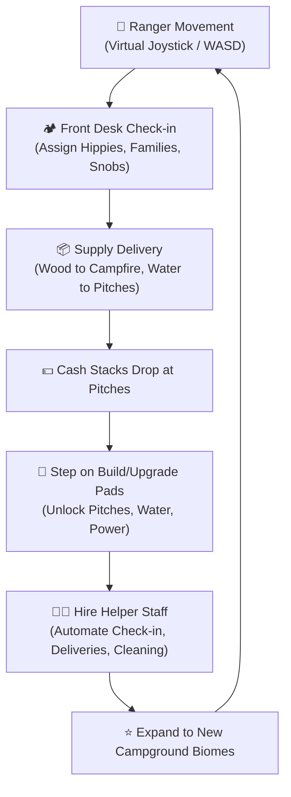
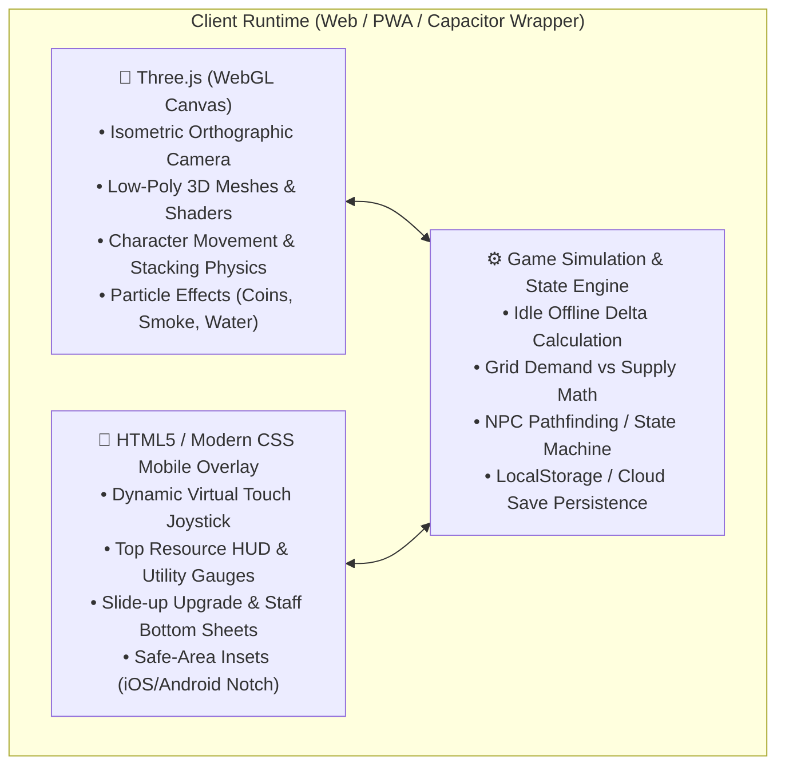

# Game Design Document – *Campers: Pocket Resort* (2D Pixel Art Edition)

> **Version:** 3.0.0  
> **Status:** Approved Direction / 2D Pixel Art (Stardew Valley / Pokémon Style)  
> **Target Platforms:** Mobile (iOS / Android Web / PWA, Native Wrapper via Capacitor)  
> **Orientation:** Portrait (9:16 to 20:9 Mobile Screen Ratio)  
> **Genre:** 2D Top-Down Arcade Idle / Cozy Camp Tycoon (*Stardew Valley*, *Pokémon GBA*, *Kairosoft* style)  
> **Visual Style:** 2D Top-Down (3/4 View) 16-Bit Pixel Art (Tilemap, animated 2D pixel character sprites, Stardew item carrying, crisp pixel scaling)

---

## 1. Executive Summary & Vision

### 1.1 Vision Statement
*Campers: Pocket Resort* captures the cozy, nostalgic warmth of classic 16-bit pixel art games like ***Stardew Valley*** and ***Pokémon (GBA)*** merged with the accessible management mechanics of ***RollerCoaster Tycoon*** and modern Arcade Idlers.

Instead of 3D polygons, the game is built entirely in **hand-crafted 2D pixel art**. Players guide the Camp Ranger through lush green meadows, winding dirt paths, and tranquil ponds. You carry chopped firewood over your head, greet pixel guests at the front desk, kindle the crackling campfire, step onto glowing build pads, and expand your campground into a bustling 5-star outdoor haven.

### 1.2 Core Pillars
1. **Authentic 16-Bit Pixel Art:** Warm Stardew/Pokémon palette, tile-based dirt trails and wildflowers, 4-directional animated pixel sprites, and cozy pixel campfires with dancing embers.
2. **Physical Arcade Idle Action:** Walk around to solve tasks—carry items above your head, chop logs, pick up dropped coin stacks, and stand on circular pads to construct new pitches.
3. **Multi-Guest Check-ins & Sleeping Capacity:** Campgrounds support up to 7 distinct pitches (Pup Tents, Caravans, Glamping Domes, and Log Cabins) accommodating **18+ simultaneous campers**. Guests arrive as individuals, couples, or family parties and occupy pitches together!
4. **The Utility Balancing Act (Electricity ⚡ & Water 💧):** Pitches require utilities to run at full speed; build pixel water wells and power generators to avoid brownouts.
5. **Automation with Pixel Helpers:** Unlock Assistant Robin to automate sweeping up coins and stocking the campfire.
6. **Mobile Portrait Ergonomics:** Dynamic virtual touch joystick (touch anywhere on the lower screen) + WASD/Arrow keys for desktop.

---

## 2. Core Game Loop: Arcade Idle Flow



### 2.1 The Gameplay Cycle
1. **Camper Arrival:** Guests arrive at the Campground Gate / Reception Desk.
2. **Player Interaction:**
   - Stand in the **Reception Pad** to assign the camper to a vacant pitch (Tents, Caravans, Glamping Domes, Cabins).
   - Deliver required supplies (e.g. Firewood to Campfires, Fresh Water bottles to Glamping tents).
3. **Satisfaction & Cash Drop:** Campers enjoy their stay, pay ongoing rent, and drop stacks of dollar bills at their pitch checkout table.
4. **Reinvestment (Stand-to-Pay Pads):**
   - The player walks onto glowing circular build pads (`[ $100 Build Tent ]`, `[ $250 Water Pump ]`).
   - Cash rapidly streams from the player's wallet into the pad until the target is met, triggering a celebratory pop and new building spawn.
5. **Automation Hand-off:**
   - Unlock the **Staff Cabin** to hire **Helper Rangers** (e.g. *Assistant Sam*, *Mechanic Bob*).
   - Helpers automatically guide guests, restock wood, and collect cash, freeing the player to explore and expand new zones.

---

## 3. Player Character & Backpack Mechanics

### 3.1 The Camp Ranger (Avatar)
- **Controls:**
  - **Mobile:** Dynamic Virtual Joystick (touch anywhere on the lower screen half to spawn joystick and run).
  - **Desktop / Dev:** WASD / Arrow Keys.
- **Attributes (Upgradable at the Ranger Station):**
  - **Movement Speed:** Initial: `6 m/s` → Max: `14 m/s`.
  - **Backpack Capacity:** Initial: `4 items` → Max: `25 items`.
  - **Interaction Radius:** Area of effect for picking up items and activating pads.

### 3.2 Visual Item Stacking
Items carried by the Ranger physically stack upward in a wobbling tower behind their back:
- 🪵 **Firewood Logs:** Used for Campfires and warming Cabins.
- 💧 **Water Canteens:** Delivered to Family pitches and Glamping sites.
- 💵 **Cash Bundles:** Carried to bank vaults or spent directly onto build pads.
- 🧹 **Trash Bags:** Collected from vacated pitches and thrown into the Recycling Dumpster.

---

## 4. Campground Infrastructure & Zones

```
+-------------------------------------------------------------+
|                      RIVER / LAKE EDGE                       |
|   [💧 Water Pump Station]          [🛶 Canoe Rental Dock]    |
|                                                             |
|   [⛺ Pitch 1: Pup Tent]           [🛖 Pitch 4: A-Frame Cabin]|
|              \                           /                  |
|               \                         /                   |
|                ---- [🔥 CENTRAL HEARTH] ----                 |
|               /                         \                   |
|              /                           \                  |
|   [🚐 Pitch 2: Caravan]            [⛺ Pitch 3: Glamping]   |
|                                                             |
|   [⚡ Generator Shed]               [🧑‍🌾 Staff Bunkhouse]     |
|                                                             |
|                   [📋 RECEPTION / CHECK-IN]                 |
|                               |                             |
|                        == ENTRANCE ROAD ==                  |
+-------------------------------------------------------------+
```

### 4.1 Accommodation Pitches
1. **Pup Tent Pitch:** Quick turnaround, low resource demand. Ideal for Hippie guests.
2. **Caravan Pitch:** Moderate income, demands water connection. Ideal for Families.
3. **Glamping Geo-Dome:** High income, requires both Electricity and Water. Loved by Snobs.
4. **A-Frame Forest Cabin:** Luxury retreat, maximum income and tip payouts.

### 4.2 Utilities (The Grid System)
- **Power Grid (⚡):**
  - *Diesel Generator → Solar Panels → Wind Turbine*.
  - When total campsite power demand exceeds generator capacity, pitches experience a blackout. The Ranger must step on the generator pad or hire Mechanic Bob to boost capacity.
- **Water Grid (💧):**
  - *Hand Pump Well → Water Tower → Alpine Filtration*.
  - Powers showers, sauna, and premium pitches.

### 4.3 Amenities & Activities
- **Central Campfire:** Gathering point for Hippies; produces bonus tips when stocked with firewood.
- **Snack Shack / Kiosk:** Automatic auxiliary income as campers buy drinks and snacks.
- **Sauna & Hot Springs:** Snobs spend heavily here if water is connected.

---

## 5. Camper Archetypes & Behaviors

| Archetype | Desired Bubble & Pitch | Key Need | Behavioral Quirk |
|---|---|---|---|
| 🌿 **Hippies** | `⛺` Tent (65%), `🚐` Caravan (35%) | Campfire & Nature | Arrive in solo/duos; generate extra tips if campfire is blazing. |
| 👨‍👩‍👧 **Families** | `🚐` Caravan (55%), `🏠` Cabin (35%), `⛺` Tent (10%) | Water & Playground | Arrive in parties of 2-3; high snack bar consumption; higher pitch stay income. |
| 💎 **Snobs** | `🛖` Glamping Dome (55%), `🏠` Cabin (35%), `🚐` Caravan (10%) | 100% Power & Water | Walk with brisk strides; drop huge piles of golden cash. |
| 🦝 **Trash Raccoon (Event)** | Dumpster | Distraction | Sneaks into camp; player must chase it off to claim a dropped loot bag. |
| 🤳 **VIP Influencer** | Any Luxury Pitch | Photo Ops | Spawns a 60-second resort-wide 2x income multiplier. |

### 5.1 Dynamic Request & Accommodation Matching
1. **Visual Speech Bubbles:** Campers arrive displaying their desired accommodation emoji above their head (`⛺` Pup Tent, `🚐` Retro Caravan, `🛖` Glamping Dome, `🏠` Log Cabin).
2. **Prioritized Matching:** The front desk first matches guests to an open pitch of their exact requested tier.
3. **Queue Polling & Non-blocking Dispatch:** If the front party is waiting for a busy Caravan, parties behind them requesting open Tents or Domes can still be checked in, preventing queue deadlocks.
4. **Flexible Fallbacks & Upgrades:** If a requested luxury tier is not yet constructed or has been occupied for over 7.5 seconds, guests accept available alternative pitches with a delighted sparkle (`✨`).

---

## 6. Multi-Worker Staff & Automation System

Automation is distributed across **8 specialized workers**, each with their own dedicated station/zone and progressive upgrade path in the **Staff & Upgrades Drawer**:

### 6.1 Front Desk Clerks (Check-in Automation)
| Worker | Role & Station | Base Cost | Max Level | Upgrade Progression |
|---|---|---|---|---|
| 🧑‍💼 **Clerk Alex** | Front Desk Clerk #1 (Reception counter left) | $75 | 4 | Lvl 1: Auto check-in every 2.0s → Lvl 2: 1.3s (+$5 tip) → Lvl 3: 0.8s (+$12 tip) → Lvl 4: 0.4s (+$22 tip) |
| 🧑‍💻 **Clerk Sam** | Front Desk Clerk #2 (Reception counter right) | $130 | 3 | Lvl 1: Dual check-in lane (1.8s +$5 tip) → Lvl 2: 1.0s (+$12 tip) → Lvl 3: VIP Express 0.5s (+$25 tip) |

*With both clerks hired, reception handles dual queue lines concurrently without requiring the player to stand at the desk.*

### 6.2 Zone Cleaners (Trash Sweeping & Cash Collection)
| Worker | Zone / Patrol Territory | Base Cost | Max Level | Upgrade Progression |
|---|---|---|---|---|
| 🧹 **Oliver** | West Meadow (Tents 1, 2, 3) | $55 | 3 | Lvl 1: Sweeps Tents at 52 px/s → Lvl 2: Roller Skates (78 px/s +$5) → Lvl 3: Turbo Sweeper (105 px/s +$15) |
| 🧽 **Chloe** | East Lane (Caravans 1, 2) | $85 | 3 | Lvl 1: Sweeps Caravans at 56 px/s → Lvl 2: Speed boost (82 px/s +$12) → Lvl 3: Eco-Mop Pro (112 px/s +$22) |
| ✨ **Felix** | North Forest (Glamping Dome & Log Cabin) | $110 | 3 | Lvl 1: Sweeps Lodges at 60 px/s → Lvl 2: Butler Polishing (88 px/s +$20) → Lvl 3: White Glove (120 px/s +$35) |

*Zone cleaners prioritize dropped cash bundles and trash bags in their designated accommodation sector before assisting neighboring areas.*

### 6.3 Specialist Workers
| Worker | Specialization & Station | Base Cost | Max Level | Upgrade Progression |
|---|---|---|---|---|
| 🎣 **Finn** | Master Fisherman (Pond Pier) | $95 | 4 | Lvl 1: Auto-catches fish every 3.6s ($30) → Lvl 2: Carbon Rod (2.5s, $50) → Lvl 3: Golden Lures (1.6s, $80) → Lvl 4: Trophy Angler (1.0s, $130) |
| ☕ **Bella** | Kiosk Barista (Snack Kiosk) | $85 | 4 | Lvl 1: Serves snacks every 4.0s ($25) → Lvl 2: Espresso Bar (2.8s, $45) → Lvl 3: Gourmet Treats (1.8s, $75) → Lvl 4: Cafe Delite (1.1s, $120) |
| 🪵 **Robin** | Fire Tender & Woodcutter (Campfire/Woodpile) | $105 | 3 | Lvl 1: Hauls 1 log at 60 px/s (+18s Frenzy) → Lvl 2: Log Cart (2 logs, 78 px/s, +28s Frenzy) → Lvl 3: Timber Master (3 logs, 98 px/s, +42s Frenzy +$25 Tip) |

### 6.4 Camp Ranger (Player Upgrades)
- 👟 **Ranger Speed:** +16 px/s per level (up to 5 levels).
- 🎒 **Backpack Carrying Slots:** +2 wood logs capacity per level (up to 5 levels).

---

## 7. Mobile UI & 2.5D Camera Specification

### 7.1 Camera Setup
- **Type:** 2.5D Isometric Camera (Orthographic or low-FOV Perspective ~30°).
- **Angle:** 40° elevation pitch, 45° horizontal azimuth.
- **Tracking:** Smooth lerp target following the Ranger with slight forward offset based on movement direction.
- **Pinch-to-Zoom:** Allows zooming in for cozy detail or out for a full resort overview.

### 7.2 Mobile Portrait UI Layout
```
+------------------------------------------+
| 📱 Notch / Safe Area                      |
| [⭐ Lv.8]  [$ 14.2K]   [🌲 12]    [⚙️][⏸️] |  <- TOP HUD (Resources & Settings)
| [⚡ 12/15 kW]       [💧 8/10 m³]   [☀️ Day] |  <- UTILITY STATUS METERS
+------------------------------------------+
|                                          |
|                                          |
|         2D ISOMETRIC WORLD               |
|      (Rendered via Three.js)             |
|                                          |
|               [⛺ Pitch]                 |
|                   \                      |
|                 [🏃 Ranger + 🪵 Stacks]  |
|                   /                      |
|              [🔥 Fire]                   |
|                                          |
|                                          |
+------------------------------------------+
|  (🕹️ Dynamic Virtual Touch Joystick)      |  <- LOWER HALF: TOUCH-ANYWHERE TO MOVE
|                                          |
| [⛺ Resort Upgrades]      [🧑‍🌾 Hire Staff] |  <- QUICK ACTION BOTTOM DRAWER TABS
| 📱 Home Gesture Bar                      |
+------------------------------------------+
```

### 7.3 Touch Ergonomics
- **No Static Joystick Required:** Touching down anywhere on the left or lower half of the screen anchors the virtual joystick center; dragging moves the Ranger.
- **Proximity Automation:** No awkward button tapping to pick up items or pay for pads; simply walking into a zone triggers the interaction automatically.
- **Haptic Feedback:** Subtle vibrations when picking up items, paying into build pads, or completing a construction.

---

## 8. Technology Stack Recommendation

### 8.1 Recommended Stack: Three.js + Vanilla JS / CSS Mobile Overlay



### 8.2 Why This Stack is the Ideal Choice:
1. **True 2D Physics & Visuals:**
   - Unlike 2D sprite sheets (which require hundreds of pre-rendered frames for 8 directions and item stacking), Three.js allows 360-degree free-form character rotation, dynamic item stacking (wood logs wobbling on the Ranger's back), and real-time shadows.
2. **Instant Cross-Platform Testing:**
   - Runs at a locked **60 FPS** in mobile Safari and Chrome on any smartphone without installing native build tools.
   - Works immediately with the existing Node/Express server in this repository, making it easy to test on local devices via ngrok or Wi-Fi.
3. **Zero Heavy Build Dependencies:**
   - Can run with standard ES modules or a blazing-fast Vite setup.
4. **Production App Store Ready:**
   - Once the web prototype is finalized, wrapping it into iOS (App Store) and Android (Google Play) via **Capacitor** or native WebView takes under an hour with 100% code reuse.

---

## 9. Implementation Roadmap

### Phase 1: Interactive 2D Prototype (Current Next Step)
- Set up Three.js 2D isometric viewport with cozy lighting and ground plane.
- Implement Ranger character with virtual joystick movement and smooth rotation.
- Create the first **Pup Tent Pitch**, **Reception Desk**, and **Proximity Build Pad**.
- Add item carrying stack mechanics (picking up wood/supplies on the Ranger's back).

### Phase 2: Campers & Utility Grid Loop
- Implement camper arrivals at the reception desk.
- Add camper pathfinding to their assigned pitch.
- Add dropped cash stacks on checkout and stand-to-collect mechanics.
- Add Power (⚡) and Water (💧) utility buildings with capacity check.

### Phase 3: Helper Staff & Upgrades
- Add Staff Bunkhouse to hire Assistant Rangers who auto-manage reception and cleaning.
- Slide-up bottom sheet upgrade drawer for Ranger speed, capacity, and pitch tiers.

### Phase 4: Polish, Audio & Mobile Feel
- Cozy campfire smoke particles, floating coin effects, and squash-and-stretch animations.
- Ambient forest soundscape (birds, crackling wood, tactile UI pops).
- Offline earnings calculator when reopening the game.
